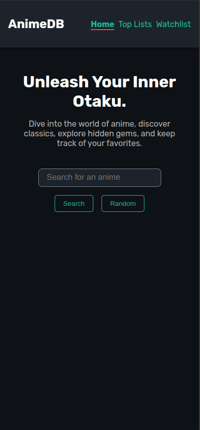
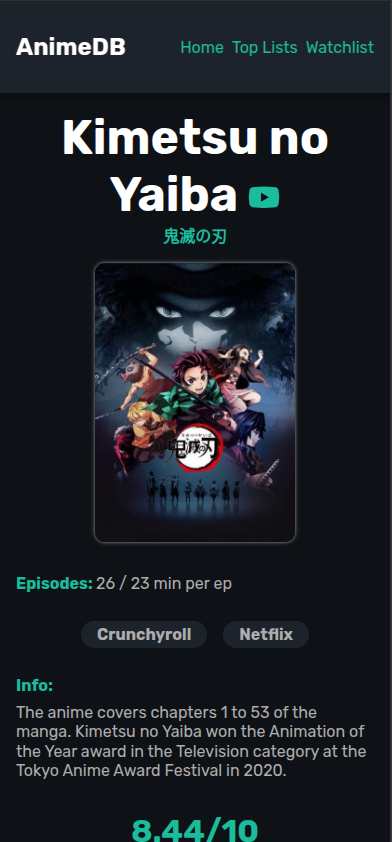
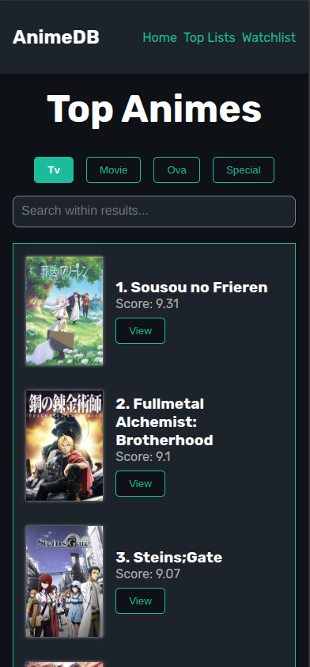
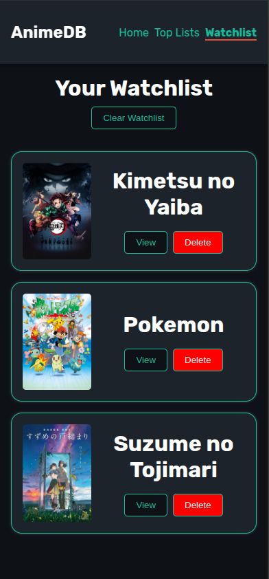

# AnimeDB 🎥📺

AnimeDB is a React-based web application that serves as an IMDb-style database for anime. It allows users to search for anime, explore detailed information, view top lists, and manage a personal watchlist. The application fetches data from the [Jikan API](https://jikan.moe/) and provides an intuitive, modern UI with `daisyUI` components.

🌐 **Live Demo**: [otakucritics.netlify.app](https://otakucritics.netlify.app/)

## 🚀 Features

- 🔍 **Search** for any anime by title
- 📊 **Detailed anime info**, including:
  - Episode count
  - Where to stream
  - General information
  - Ratings
  - Genres
  - Summary
  - YouTube trailer
  - Japanese and English titles
- 📜 **Top Lists** for:
  - Anime 🎬
  - Manga 📖
  - Characters 👤
  - People (Voice actors, mangakas, etc.) 🎤
- 📌 **Watchlist** with local storage support

## 🛠️ Technologies Used

- **Frontend**: React + Vite ⚡
- **Fetching Data**: Axios
- **Routing**: React Router DOM
- **UI Components**: DaisyUI, FontAwesome icons
- **State Management**: Local Storage for watchlist
- **API**: Jikan API ([jikan.moe](https://jikan.moe/))

## 📁 Project Structure

```
.
├── dist/                  # Production build output
├── public/                # Static assets
├── src/                   # Source files
│   ├── assets/            # Images & Icons
│   │   ├── screenshots/   # Screenshots of the app
│   ├── components/        # React components
│   │   ├── subcomps/      # Sub-components
│   ├── Layout/            # Layout components (Header, Footer, etc.)
│   ├── styles/            # CSS styles
│   ├── App.jsx            # Main App component
│   ├── main.jsx           # Entry point
│   ├── index.css          # Global styles
├── package.json           # Project metadata
├── vite.config.js         # Vite configuration
└── README.md              # Project documentation
```

## 📦 Installation & Usage

### 1️⃣ Clone the Repository

```sh
git clone https://github.com/yousifpa98/anime-db.git
cd anime-db
```

### 2️⃣ Install Dependencies

```sh
npm install
```

### 3️⃣ Run the Development Server

```sh
npm run dev
```

### 4️⃣ Build for Production

```sh
npm run build
```

### 5️⃣ Preview Production Build

```sh
npm run preview
```

## 🖼️ Screenshots

### Home Page


### Anime Overview


### Top Lists


### Watchlist


## 🎭 Credits

- Data provided by [Jikan API](https://jikan.moe/)
- UI powered by [DaisyUI](https://daisyui.com/)
- Icons from [FontAwesome](https://fontawesome.com/)
- Various images sourced from anime

## 📜 License

This project is licensed under the MIT License - see the [LICENSE](LICENSE) file for details.

---

🎉 **Enjoy using AnimeDB!** Feel free to contribute or suggest improvements.